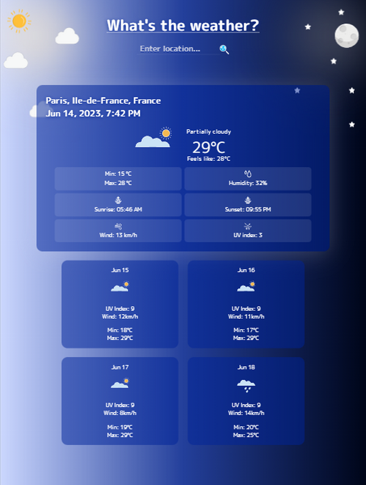

# Weather App

This is weather forecast application, an API based project. By default it displays current weather information based on user's location.
It provides weather data (current weather and 4-days forecast) for any searched location. This app is responsive for all screen sizes. 

## Demo

[What's the weather?](https://r-svet-weather.netlify.app/)

## Made with

- Html
- Sass
- JavaScript(asynchronous functions, modules, parcel, Ajax calls)
- API ([Visual Crossing](https://www.visualcrossing.com/weather-api) for weather details, [Open Cage](https://opencagedata.com/) for geocoding)

## Usage

The app is easy to use. By entering desired location and hitting enter or search icon it displays card with current weather details.
Depending on the screen size it also displays 4-days forecast. On big screens future weather details are displayed by hovering the card, while on small screens
this details are shown below the current weather information.
